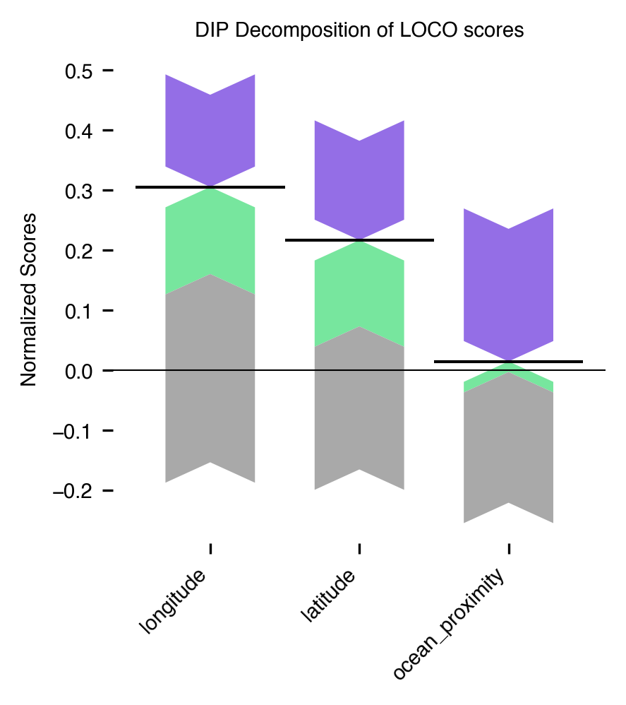

# DIPD Package

**The DIP Decomposition** is a loss-based global feature attribution technique, that explains how much each feature contributes to the predictive performance.
In contrast to standard feature attribution techniques it separates the standalone contributions of the individual features and cooperative contributions stemming from interactions and dependencies between features.

The DIP decomposition was introduced in [this paper](https://arxiv.org/pdf/2410.23772).

## Installation

`dipd` is intended to work with **python 3.11.** and newer. 
It can be installed as follows.
```
git clone https://github.com/gcskoenig/dipd
cd dipd
pip install .
```

Soon, the package will also be available on pypi.

## Usage

As follows we illustrate the package on a reduced version of the California housing dataset with just three features: longitude, latitude, and ocean proximity. 
Specifically, we compute and decompose the Leave-One-Covariate-Out (LOCO) scores based on explainable boosting machines (EBM) and decompose these scores into the feature's standalone contribution, and the contributions stemming from interactions and dependencies with the remaining features. 

```python
## load data and preprocess data
import pandas as pd
import category_encoders as ce

varnames = ['longitude', 'latitude', 'ocean_proximity', 'median_house_value']
target_variable = 'median_house_value'
df = pd.read_csv('https://raw.githubusercontent.com/ageron/handson-ml2/master/datasets/housing/housing.csv').dropna()[varnames]
encoder = ce.OrdinalEncoder()
df = encoder.fit_transform(df)

## perform leave-one-covariate-out DIP decomposition
from dipd import DIP
from dipd.learners import EBM

explainer = DIP(df, target_variable, EBM)
explanation = explainer.get_all_loo()
print(explanation.scores)

## plot the results
import matplotlib.pyplot as plt
from dipd.plots import forceplot

ax = forceplot(explanation.scores.T, 'DIP Decomposition of LOCO scores',
               figsize=(3, 3), explain_surplus=True)
ax.get_legend().remove()
plt.show()
```

The code produces the following plot.




The plot can be interpreted as follows: Each bar explains one LOCO score as the sum of standalone contribution (gray)
 and the contributions of interactions (green) and dependencies (purple).
 Each bar is visualized as a forceplot, meaning that the direction of each bar indicates the sign, where downward facing bars are negative contributions and upward facing bars positive contributions. The bars sum up to the black horizontal lines, which are the LOCO scores of the features.